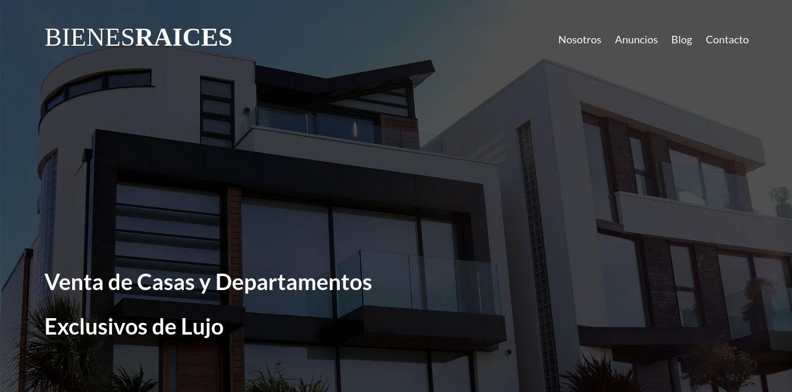

# Sitio Web de Bienes Raices (Front-End).
_Sitio web front-end útil para una empresa de bienes raíces con lista de casa en venta y formulario de contacto._

### Pre-requisitos 📋
_Navegador de smartphone o de computadora_

## Construido con 🛠️
* [JavaScript](http://www.javascript.com/) - Para programación Front-End.
* [CSS](https://www.w3.org/Style/CSS/Overview.en.html) - Para la presentación del documento.
* [HTML](https://rometools.github.io/rome/) - Para la elaboración de páginas web.

## ❤️❤️❤️ Sitio Web (_Haga click a la imagen_) ❤️❤️❤️

